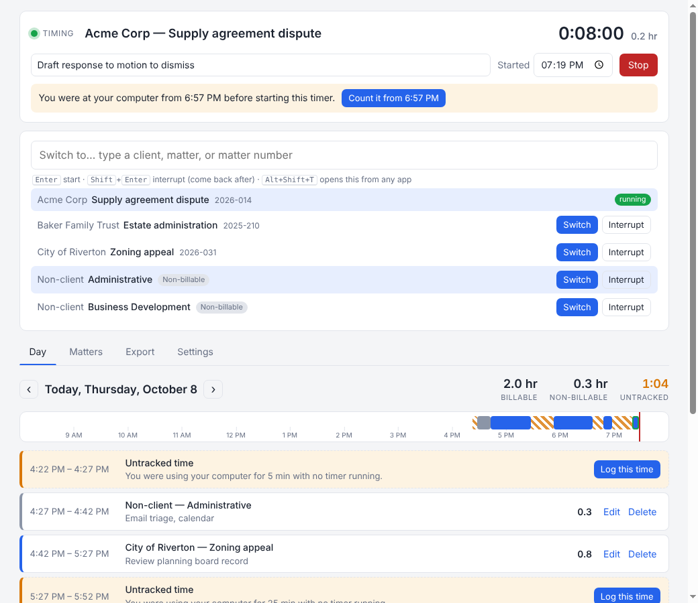

# Time Logger

A time tracker for attorneys who are bad at tracking time. It runs in Microsoft
Edge (or Chrome), with nothing to install, keeps one timer running on whatever
matter you're working on, and catches the time that usually slips through the
cracks.

**Your data stays on your PC.** Time entries are stored in your browser's own
storage on your computer. They are never sent to GitHub or anywhere else.
GitHub only hosts the app's code.



## What it does

| Problem | How the app handles it |
| --- | --- |
| **Forgetting to start a timer** | A Windows notification reminds you when you're working during work hours with no timer running. The tab icon turns red, and an installed app gets a badge on its taskbar icon. When you do start a timer, it offers to backdate it to when you sat down ("Count it from 9:12"). |
| **Forgetting to stop a timer** | If you step away (no keyboard or mouse use for 5 minutes, screen locked, PC asleep, or browser closed) while a timer runs, it asks when you return: remove the away time, stop the timer as of when you left, keep it (you were on a call), or log it to a different matter. |
| **Reconstructing the day** | The Day view shows a timeline with **untracked gaps**. Click **Log this time** on a gap to assign it to a matter. At the end of the workday you get a "Review your day" prompt. |
| **Interruptions** | **Interrupt** (or <kbd>Shift</kbd>+<kbd>Enter</kbd>) pauses the current matter and times the interruption; **Back to it** resumes the original matter with its description. |
| **Keeping the timer in view** | **Pop out timer** opens a small window that stays on top of Word and Outlook, where you can edit the narrative, stop, or switch matters. The **–** button minimizes it to just the matter and clock. |

### Billing rules
- Time is rounded **up** to the billing increment (0.1 hr by default; 0.25 available).
- By default, a day's time on the same matter is **added up before rounding**, so
  three 4-minute fragments bill as 0.2, not 0.3. You can turn this off in
  Settings or for a single export.
- Accidental blips (under one minute with no description) are discarded.
- Non-client time (Administrative, Business Development, CLE & Training, Pro
  Bono) is built in and tracked as non-billable. Add your own on the Matters tab.

### Export
The Export tab downloads a CSV (Date, Client, Matter, Matter Number, Billable,
Hours, Minutes, Description) for any date range. Open it in Excel or import it
into your billing software. A running timer isn't exported until you stop it.

### Entering time in iTimeKeep
A helper fills iTimeKeep's time entry form for you, one entry at a time. It
never saves anything; you check each entry and click iTK's own **Save**.

1. **One-time setup:** on the Export tab, open **Enter this time in iTimeKeep**
   and drag the **TL → iTimeKeep** button to your Edge favorites bar. Make sure
   each matter on the Matters tab has its iTK matter number.
2. Choose the dates and click **Copy for iTimeKeep**.
3. In iTimeKeep, open a new time entry and click the **TL → iTimeKeep**
   favorite. Paste into the panel that appears.
4. **The first time only,** the helper watches you start one practice
   entry and remembers each step: click New Time Entry (the entry window
   opens), click the Date field, open the matter list, click its search box
   and type any matter number, click Search (or tell it you press Enter),
   click the matter in the results, then click the Hours and Narrative
   fields. Your clicks work normally while it watches. Close the practice
   entry without saving. Misclicked? **← Back** redoes the last step.
5. For each entry, click **Fill in iTimeKeep**. The helper opens a new entry,
   types the date, looks up the matter number and clicks the result showing
   exactly that number, then fills in hours and narrative. Check the entry,
   click **Save** in iTK, then click **I saved it → next**.

The helper works through your normal logged-in iTK session and your own
clicks. It doesn't get around any iTK restrictions, and it can't fill a field
iTK has locked; it tells you which fields to finish yourself. If a later iTK
update moves things around, use ⚙ → **Re-teach**. The entry form can be in
a dialog on the page or in a separate window that iTK opens. Entries reach iTK
only through your clipboard.

## First-time setup in Edge (about 2 minutes)

1. Open the app's address: **https://agbriggs2.github.io/attorney_time_logger/**
2. **Install it as an app.** Use the **⋯** menu → **Apps** → **Install this site
   as an app**. Then right-click its taskbar icon and choose **Pin to taskbar**.
   It gets its own window, a taskbar badge when no timer is running, and better
   protection against Edge clearing its data.
3. Click the buttons in the blue **Finish setting up** banner:
   - **Allow notifications** for the reminders. Then use **Send a test** under
     Settings → Setup check to confirm they appear. If they don't, check Windows
     Settings → System → Notifications, and Focus / Do not disturb.
   - **Allow away detection** so the app knows when you step away or lock your
     screen. It sees only *whether* the keyboard or mouse is in use, never what
     you're doing.
   - **Choose a backup folder** (for example Documents). A copy of your data is
     saved there daily, and the last 30 days are kept. If Edge later asks again,
     choose **Allow on every visit**.
4. **Keep it awake.** In Edge **Settings → System and performance**, add
   `agbriggs2.github.io` under **Never put these sites to sleep**, so reminders
   keep running while the app sits in the background.

Settings → **Setup check** shows the status of each of these at any time.

### Good to know
- **Leave the app open while you work.** Reminders stop when Edge or the app
  window is closed. When you reopen it, it asks about the time it was closed.
- **Only one copy runs at a time.** If you open it in a second tab, that tab
  offers to take over.
- **Don't use an InPrivate window.** Everything would be erased when the window
  closes.
- **Clearing Edge's browsing data for this site erases your entries.** Keep the
  backup folder turned on. To move to a new PC, use **Download a backup file**
  and then **Restore from a backup file** on the new machine.

## Development

There's no build step and there are no dependencies, just Node.js 20+ for
testing.

```sh
npm start   # serves the app at http://localhost:8080
npm test    # unit tests for the timer, rounding, gap and CSV logic
```

Every push runs the tests. A push to the default branch also publishes the
`app/` folder to GitHub Pages (`.github/workflows/pages.yml`).

```
app/core/       Pure logic, unit-tested: timer operations, rounding, gap detection, CSV
app/js/         Browser code: engine (reminders, idle detection), storage, UI, mini timer,
                and itk-helper.js (the iTimeKeep bookmarklet)
app/sw.js       Offline cache of the app's files (not your data)
test/           node:test unit tests; fixtures/mock-itimekeep.html for testing the iTK helper
docs/DESIGN.md  Design notes and roadmap
```
